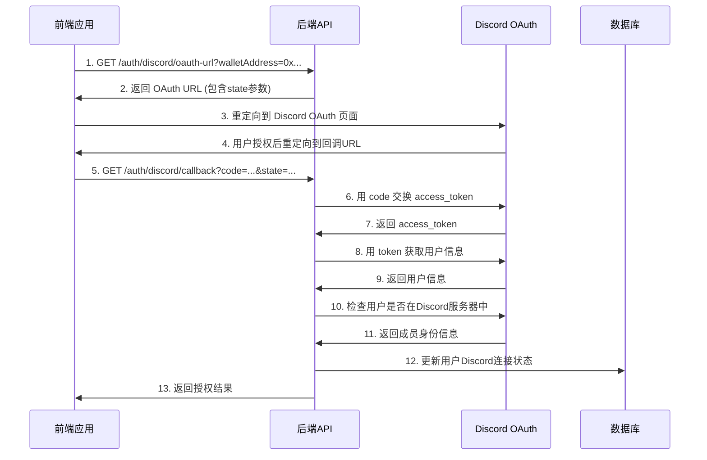

# Discord OAuth 前端集成指南

## 概述

本指南详细说明了如何在前端应用中集成 Discord OAuth 登录功能，包括调用后端API、处理回调URL以及完整的用户授权流程。

## 🔧 后端API接口

### 1. 获取 Discord OAuth 授权链接

**接口:** `GET /auth/discord/oauth-url`

**参数:**
- `walletAddress` (必需): 用户的钱包地址

**响应:**
```json
{
  "oauthUrl": "https://discord.com/api/oauth2/authorize?client_id=...&redirect_uri=...&response_type=code&scope=identify+guilds&state=...",
  "walletAddress": "0x1234567890123456789012345678901234567890"
}
```

### 2. 直接重定向到 Discord (可选)

**接口:** `GET /auth/discord/oauth`

**参数:**
- `walletAddress` (必需): 用户的钱包地址

**响应:** 302 重定向到 Discord OAuth 页面

### 3. OAuth 回调处理

**接口:** `GET /auth/discord/callback`

**参数:**
- `code`: Discord 授权码 (由 Discord 提供)
- `state`: OAuth 状态参数 (包含钱包地址)

**响应:**
```json
{
  "success": true,
  "discordId": "123456789",
  "username": "user#1234",
  "isInGuild": true,
  "walletAddress": "0x1234567890123456789012345678901234567890",
  "message": "Discord connection successful! You are a member of the 0G Discord server."
}
```

### 4. 检查 Discord 连接状态

**接口:** `GET /auth/discord/status`

**参数:**
- `discordId`: Discord 用户 ID

**响应:**
```json
{
  "connected": true,
  "username": "user#1234",
  "userId": "123456789",
  "verified": true,
  "connectedAt": "2024-01-01T10:30:00.000Z"
}
```

### 5. 获取 Discord 服务器邀请链接

**接口:** `GET /auth/discord/guild-invite`

**响应:**
```json
{
  "inviteUrl": "https://discord.gg/0g-network",
  "guildName": "0G Network Discord Server"
}
```

## 🌐 环境变量配置

后端需要配置以下环境变量：

```bash
# Discord OAuth 配置
DISCORD_CLIENT_ID="你的Discord应用Client ID"
DISCORD_CLIENT_SECRET="你的Discord应用Client Secret"
DISCORD_REDIRECT_URI="https://yourdomain.com/auth/discord/callback"
DISCORD_GUILD_ID="你的Discord服务器ID"
```

## 💻 前端实现示例

### 1. React + TypeScript 实现

```typescript
// types/discord.ts
export interface DiscordOAuthResponse {
  oauthUrl: string;
  walletAddress: string;
}

export interface DiscordCallbackResult {
  success: boolean;
  discordId: string;
  username: string;
  isInGuild: boolean;
  walletAddress: string;
  message: string;
}

// services/discordAuth.ts
import axios from 'axios';

const API_BASE_URL = 'https://yourdomain.com/api';

export class DiscordAuthService {
  /**
   * 获取 Discord OAuth 授权链接
   */
  static async getOAuthUrl(walletAddress: string): Promise<DiscordOAuthResponse> {
    const response = await axios.get(`${API_BASE_URL}/auth/discord/oauth-url`, {
      params: { walletAddress }
    });
    return response.data;
  }

  /**
   * 检查 Discord 连接状态
   */
  static async checkStatus(discordId: string) {
    const response = await axios.get(`${API_BASE_URL}/auth/discord/status`, {
      params: { discordId }
    });
    return response.data;
  }

  /**
   * 获取 Discord 服务器邀请链接
   */
  static async getGuildInvite() {
    const response = await axios.get(`${API_BASE_URL}/auth/discord/guild-invite`);
    return response.data;
  }
}

// components/DiscordAuthButton.tsx
import React, { useState } from 'react';
import { DiscordAuthService } from '../services/discordAuth';

interface Props {
  walletAddress: string;
  onSuccess?: (result: DiscordCallbackResult) => void;
  onError?: (error: string) => void;
}

export const DiscordAuthButton: React.FC<Props> = ({ 
  walletAddress, 
  onSuccess, 
  onError 
}) => {
  const [isLoading, setIsLoading] = useState(false);

  const handleDiscordAuth = async () => {
    if (!walletAddress) {
      onError?.('钱包地址是必需的');
      return;
    }

    try {
      setIsLoading(true);
      
      // 获取 OAuth URL
      const { oauthUrl } = await DiscordAuthService.getOAuthUrl(walletAddress);
      
      // 打开新窗口进行 OAuth
      const popup = window.open(
        oauthUrl,
        'discord-oauth',
        'width=500,height=600,scrollbars=yes,resizable=yes'
      );

      // 监听回调
      const checkClosed = setInterval(() => {
        if (popup?.closed) {
          clearInterval(checkClosed);
          setIsLoading(false);
          // 这里可以检查授权是否成功
          // 实际应用中，你可能需要通过其他方式获知授权结果
        }
      }, 1000);

    } catch (error) {
      setIsLoading(false);
      onError?.(error instanceof Error ? error.message : '授权失败');
    }
  };

  return (
    <button 
      onClick={handleDiscordAuth}
      disabled={isLoading || !walletAddress}
      className="discord-auth-btn"
    >
      {isLoading ? '正在授权...' : '连接 Discord'}
    </button>
  );
};
```

### 2. Vue 3 + TypeScript 实现

```typescript
<!-- DiscordAuth.vue -->
<template>
  <div class="discord-auth">
    <button 
      @click="handleDiscordAuth" 
      :disabled="isLoading || !walletAddress"
      class="discord-btn"
    >
      {{ isLoading ? '正在授权...' : '连接 Discord' }}
    </button>
  </div>
</template>

<script setup lang="ts">
import { ref } from 'vue';
import axios from 'axios';

interface Props {
  walletAddress: string;
}

const props = defineProps<Props>();
const emit = defineEmits(['success', 'error']);

const isLoading = ref(false);
const API_BASE_URL = 'https://yourdomain.com/api';

const handleDiscordAuth = async () => {
  if (!props.walletAddress) {
    emit('error', '钱包地址是必需的');
    return;
  }

  try {
    isLoading.value = true;
    
    // 获取 OAuth URL
    const response = await axios.get(`${API_BASE_URL}/auth/discord/oauth-url`, {
      params: { walletAddress: props.walletAddress }
    });
    
    const { oauthUrl } = response.data;
    
    // 直接跳转到 Discord OAuth 页面
    window.location.href = oauthUrl;
    
    // 或者在新窗口中打开
    // const popup = window.open(oauthUrl, 'discord-oauth', 'width=500,height=600');
    
  } catch (error) {
    isLoading.value = false;
    emit('error', error instanceof Error ? error.message : '授权失败');
  }
};
</script>
```

### 3. 原生 JavaScript 实现

```javascript
// discord-auth.js
class DiscordAuth {
  constructor(apiBaseUrl) {
    this.apiBaseUrl = apiBaseUrl;
  }

  async getOAuthUrl(walletAddress) {
    const response = await fetch(
      `${this.apiBaseUrl}/auth/discord/oauth-url?walletAddress=${encodeURIComponent(walletAddress)}`
    );
    return response.json();
  }

  async startOAuth(walletAddress) {
    try {
      const { oauthUrl } = await this.getOAuthUrl(walletAddress);
      
      // 方法1: 直接跳转
      window.location.href = oauthUrl;
      
      // 方法2: 弹窗授权
      // const popup = window.open(
      //   oauthUrl,
      //   'discord-oauth',
      //   'width=500,height=600,scrollbars=yes,resizable=yes'
      // );
      
      return true;
    } catch (error) {
      console.error('Discord OAuth failed:', error);
      return false;
    }
  }
}

// 使用示例
const discordAuth = new DiscordAuth('https://yourdomain.com/api');

document.getElementById('discord-btn').addEventListener('click', async () => {
  const walletAddress = '0x1234567890123456789012345678901234567890';
  await discordAuth.startOAuth(walletAddress);
});
```

## 🔄 OAuth 流程详解

### 完整的授权流程



### State 参数说明

后端会将钱包地址编码到 `state` 参数中，确保 Discord 账户与特定钱包地址绑定：

```typescript
// 生成 state 参数（后端逻辑）
private generateState(walletAddress?: string): string {
  const timestamp = Date.now();
  const data = {
    walletAddress,
    timestamp,
    random: Math.random().toString(36).substring(7)
  };
  return Buffer.from(JSON.stringify(data)).toString('base64');
}

// 解析 state 参数（后端逻辑）
extractWalletAddressFromState(state?: string): string | null {
  if (!state) return null;
  try {
    const decoded = JSON.parse(Buffer.from(state, 'base64').toString());
    return decoded.walletAddress || null;
  } catch {
    return null;
  }
}
```

## 🎯 前端回调处理策略

### 策略1: 同窗口重定向 (推荐)

```typescript
// 直接在当前窗口进行授权
const handleDiscordAuth = async () => {
  const { oauthUrl } = await DiscordAuthService.getOAuthUrl(walletAddress);
  window.location.href = oauthUrl;
  // Discord 会重定向回 /auth/discord/callback
  // 前端需要在回调页面处理结果
};
```

### 策略2: 弹窗授权

```typescript
// 在弹窗中进行授权
const handleDiscordAuth = async () => {
  const { oauthUrl } = await DiscordAuthService.getOAuthUrl(walletAddress);
  
  const popup = window.open(
    oauthUrl,
    'discord-oauth',
    'width=500,height=600,scrollbars=yes,resizable=yes'
  );

  // 监听弹窗关闭或消息
  const checkClosed = setInterval(() => {
    if (popup?.closed) {
      clearInterval(checkClosed);
      // 检查授权结果
      checkAuthStatus();
    }
  }, 1000);
};
```

### 策略3: PostMessage 通信

```typescript
// 在回调页面发送消息给父窗口
// callback.html
<script>
  const urlParams = new URLSearchParams(window.location.search);
  const result = {
    success: urlParams.get('success'),
    discordId: urlParams.get('discordId'),
    username: urlParams.get('username'),
    isInGuild: urlParams.get('isInGuild'),
    message: urlParams.get('message')
  };
  
  // 发送结果给父窗口
  if (window.opener) {
    window.opener.postMessage(result, '*');
    window.close();
  }
</script>

// 主页面监听消息
window.addEventListener('message', (event) => {
  if (event.data && event.data.success) {
    // 处理授权成功
    console.log('Discord auth successful:', event.data);
  }
});
```

## 🛠️ 开发环境配置

### 1. Discord 应用设置

1. 访问 [Discord Developer Portal](https://discord.com/developers/applications)
2. 创建新应用或选择现有应用
3. 在 "OAuth2" → "Redirects" 中添加回调URL：
   ```
   开发环境: http://localhost:3000/auth/discord/callback
   生产环境: https://yourdomain.com/auth/discord/callback
   ```
4. 在 "OAuth2" → "Scopes" 中选择：`identify` 和 `guilds`

### 2. 本地开发配置

```bash
# .env.local (前端)
REACT_APP_API_BASE_URL=http://localhost:3000/api

# .env (后端)
DISCORD_CLIENT_ID="你的Discord应用ID"
DISCORD_CLIENT_SECRET="你的Discord应用密钥"
DISCORD_REDIRECT_URI="http://localhost:3000/auth/discord/callback"
DISCORD_GUILD_ID="你的Discord服务器ID"
```

### 3. 生产环境配置

```bash
# 生产环境变量
DISCORD_CLIENT_ID="生产环境Discord应用ID"
DISCORD_CLIENT_SECRET="生产环境Discord应用密钥"
DISCORD_REDIRECT_URI="https://yourdomain.com/auth/discord/callback"
DISCORD_GUILD_ID="Discord服务器ID"
```

## 🔍 调试和故障排除

### 常见问题

1. **回调URL不匹配**
   - 确保 Discord 应用中配置的回调URL与代码中的完全一致
   - 注意 HTTP 和 HTTPS 的区别

2. **State 参数错误**
   - 检查钱包地址是否正确传递
   - 确保 state 参数在往返过程中没有被修改

3. **跨域问题**
   - 确保后端正确配置了 CORS
   - 检查前端请求的域名和端口

4. **授权范围不足**
   - 确保请求了正确的 OAuth 范围：`identify guilds`
   - 检查用户是否拒绝了某些权限

### 调试技巧

```typescript
// 在前端添加详细日志
const handleDiscordAuth = async () => {
  console.log('Starting Discord auth with wallet:', walletAddress);
  
  try {
    const response = await DiscordAuthService.getOAuthUrl(walletAddress);
    console.log('OAuth URL received:', response.oauthUrl);
    
    window.location.href = response.oauthUrl;
  } catch (error) {
    console.error('Discord auth error:', error);
    console.error('Error details:', error.response?.data);
  }
};
```

## 📱 移动端适配

### 移动端注意事项

1. **弹窗限制**: 移动浏览器可能阻止弹窗，建议使用同窗口重定向
2. **应用切换**: 考虑用户可能切换到 Discord 应用进行授权
3. **返回处理**: 确保用户能顺利返回到你的应用

### 移动端实现示例

```typescript
// 检测移动设备
const isMobile = /Android|webOS|iPhone|iPad|iPod|BlackBerry|IEMobile|Opera Mini/i.test(
  navigator.userAgent
);

const handleDiscordAuth = async () => {
  const { oauthUrl } = await DiscordAuthService.getOAuthUrl(walletAddress);
  
  if (isMobile) {
    // 移动端直接跳转
    window.location.href = oauthUrl;
  } else {
    // 桌面端可以使用弹窗
    const popup = window.open(oauthUrl, 'discord-oauth', 'width=500,height=600');
  }
};
```

## 🎉 总结

通过以上指南，你可以成功在前端应用中集成 Discord OAuth 功能。关键点包括：

1. **正确配置回调URL**: 确保 Discord 应用和后端配置一致
2. **处理状态参数**: 使用 state 参数绑定钱包地址和 Discord 账户
3. **选择合适的授权策略**: 根据应用需求选择重定向或弹窗方式
4. **完善错误处理**: 提供清晰的错误信息和用户反馈
5. **移动端适配**: 考虑不同设备的用户体验

如果你有任何问题或需要进一步的帮助，请随时询问！