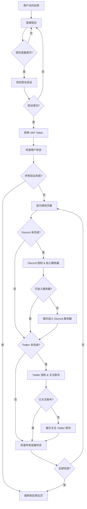

# 前端登录集成指南

## 概述

本指南详细说明了前端应用的完整登录流程，包括钱包连接、Discord/Twitter 授权验证，以及整个用户身份验证的前端实现方案。

## 🎯 完整登录流程概览



## 📋 流程步骤详解

> **⚠️ 重要提示：完整验证要求**
> 
> 本系统要求用户完成以下**所有**验证步骤才能正常使用：
> - ✅ **钱包连接**：连接并验证钱包身份
> - ✅ **Discord 验证**：授权登录 **且** 加入指定 Discord 服务器
> - ✅ **Twitter 验证**：授权登录 **且** 关注指定 Twitter 账号
>
> 只有当 `allConnected: true` 时，用户才能访问完整功能。

### 1. 钱包连接与登录

用户首先需要连接钱包并完成签名验证以获得身份认证。

**流程：**
1. 用户点击"连接钱包"按钮
2. 选择钱包(MetaMask, WalletConnect等)
3. 获取钱包地址
4. 请求签名 nonce
5. 用户钱包签名
6. 验证签名并获得 JWT Token

### 2. 用户状态检查

钱包登录成功后，需要检查用户的 Discord 和 Twitter 连接状态。

**流程：**
1. 使用钱包地址查询用户状态
2. 检查 `discordConnected` 和 `twitterConnected` 状态
3. 检查 `isJoined` (Discord服务器) 和 `isFollowed` (Twitter关注) 状态
4. 根据状态决定是否需要进行授权验证

### 3. Discord/Twitter 授权验证

如果用户尚未完成 Discord 或 Twitter 连接，引导用户进行授权。

**Discord 验证要求：**
- 用户必须授权登录 Discord (`discordConnected`)
- 用户必须加入指定的 Discord 服务器 (`isJoined`)

**Twitter 验证要求：**
- 用户必须授权登录 Twitter (`twitterConnected`)
- 用户必须关注指定的 Twitter 账号 (`isFollowed`)

**流程：**
1. 显示授权页面，列出未完成的连接
2. 用户点击 Discord/Twitter 授权按钮
3. 跳转到对应的 OAuth 页面
4. 用户完成授权后，系统自动检查服务器加入/账号关注状态
5. 更新用户连接状态

### 4. 完成后跳转

所有验证完成后，用户可以正常使用应用功能。

**流程：**
1. 检查 `allConnected` 状态（要求所有条件都满足）
   - `walletConnected: true`
   - `discordConnected: true` && `isJoined: true`
   - `twitterConnected: true` && `isFollowed: true`
2. 如果全部完成，跳转到应用主页
3. 如果部分完成，提示用户完成剩余步骤

## 🔧 核心API接口

### 1. 钱包登录相关

#### 获取签名 Nonce
**接口:** `GET /auth/wallet/nonce?walletAddress=0x...`

**响应:**
```json
{
  "nonce": "abc123def456",
  "message": "Please sign this message to verify your wallet: abc123def456",
  "expiresAt": "2024-01-01T10:40:00.000Z"
}
```

#### 验证钱包签名并登录
**接口:** `POST /auth/wallet/verify`

**请求体:**
```json
{
  "walletAddress": "0x1234...",
  "nonce": "abc123def456",
  "signature": "0x123abc..."
}
```

**响应:**
```json
{
  "verified": true,
  "walletAddress": "0x1234...",
  "access_token": "eyJhbGciOiJIUzI1NiIs...",
  "user": {
    "id": "clj123456789",
    "walletAddress": "0x1234...",
    "discordConnected": false,
    "twitterConnected": false,
    "walletConnected": true,
    "isJoined": false,
    "isFollowed": false,
    "allConnected": false,
    "status": "NORMAL"
  }
}
```

### 2. 用户状态查询

#### 获取用户状态
**接口:** `GET /social/user-status?walletAddress=0x...`

**响应:**
```json
{
  "walletAddress": "0x1234...",
  "discordConnected": false,
  "twitterConnected": false,
  "walletConnected": true,
  "isJoined": false,
  "isFollowed": false,
  "allConnected": false,
  "completedAt": null,
  "nextSteps": [
    {
      "platform": "discord",
      "action": "connect",
      "description": "Connect your Discord account and join the server",
      "completed": false
    },
    {
      "platform": "twitter", 
      "action": "connect",
      "description": "Connect your Twitter account and follow our account",
      "completed": false
    }
  ]
}
```

### 3. Discord 授权相关

#### 获取 Discord OAuth 授权链接
**接口:** `GET /auth/discord/oauth-url?walletAddress=0x...`

**响应:**
```json
{
  "oauthUrl": "https://discord.com/api/oauth2/authorize?client_id=...&redirect_uri=...&response_type=code&scope=identify+guilds&state=...",
  "walletAddress": "0x1234567890123456789012345678901234567890"
}
```

#### Discord OAuth 回调处理
**接口:** `GET /auth/discord/callback?code=...&state=...`

**响应:**
```json
{
  "success": true,
  "discordId": "123456789",
  "username": "user#1234",
  "isInGuild": true,
  "walletAddress": "0x1234567890123456789012345678901234567890",
  "message": "Discord connection successful! You are a member of the 0G Discord server.",
  "note": "isInGuild 必须为 true 才算完成验证"
}
```

#### 检查 Discord 连接状态
**接口:** `GET /auth/discord/status?discordId=123456789`

**响应:**
```json
{
  "connected": true,
  "username": "user#1234",
  "userId": "123456789",
  "verified": true,
  "connectedAt": "2024-01-01T10:30:00.000Z"
}
```

### 4. Twitter 授权相关

#### 获取 Twitter OAuth 授权链接
**接口:** `GET /auth/twitter/oauth-url?walletAddress=0x...`

**响应:**
```json
{
  "oauthUrl": "https://api.twitter.com/oauth/authorize?oauth_token=...",
  "walletAddress": "0x1234567890123456789012345678901234567890"
}
```

#### Twitter OAuth 回调处理
**接口:** `GET /auth/twitter/callback?oauth_token=...&oauth_verifier=...`

**响应:**
```json
{
  "success": true,
  "twitterId": "987654321",
  "username": "dollyuser",
  "isFollowing": true,
  "walletAddress": "0x1234567890123456789012345678901234567890",
  "message": "Twitter connection successful! You are now following our account.",
  "note": "isFollowing 必须为 true 才算完成验证"
}
```

## 🌐 环境变量配置

后端需要配置以下环境变量：

```bash
# Discord OAuth 配置
DISCORD_CLIENT_ID="你的Discord应用Client ID"
DISCORD_CLIENT_SECRET="你的Discord应用Client Secret"
DISCORD_REDIRECT_URI="https://yourdomain.com/auth/discord/callback"
DISCORD_GUILD_ID="你的Discord服务器ID"
```

## 💻 前端实现示例

### 1. React + TypeScript 完整登录实现

```typescript
// types/auth.ts
export interface WalletLoginResponse {
  verified: boolean;
  walletAddress: string;
  access_token: string;
  user: {
    id: string;
    walletAddress: string;
    discordConnected: boolean;
    twitterConnected: boolean;
    walletConnected: boolean;
    isJoined: boolean;
    isFollowed: boolean;
    allConnected: boolean;
    status: string;
  };
}

export interface UserStatus {
  walletAddress: string;
  discordConnected: boolean;
  twitterConnected: boolean;
  walletConnected: boolean;
  isJoined: boolean;
  isFollowed: boolean;
  allConnected: boolean;
  completedAt?: string;
  nextSteps: {
    platform: string;
    action: string;
    description: string;
  }[];
}

export interface OAuthResponse {
  oauthUrl: string;
  walletAddress: string;
}

// services/authService.ts
import axios from 'axios';

const API_BASE_URL = 'https://yourdomain.com/api';

export class AuthService {
  private static token: string | null = null;

  /**
   * 设置 axios 默认 headers
   */
  static setAuthToken(token: string) {
    this.token = token;
    axios.defaults.headers.common['Authorization'] = `Bearer ${token}`;
  }

  /**
   * 获取钱包签名 nonce
   */
  static async getWalletNonce(walletAddress: string) {
    const response = await axios.get(`${API_BASE_URL}/auth/wallet/nonce`, {
      params: { walletAddress }
    });
    return response.data;
  }

  /**
   * 验证钱包签名并登录
   */
  static async verifyWallet(walletAddress: string, nonce: string, signature: string): Promise<WalletLoginResponse> {
    const response = await axios.post(`${API_BASE_URL}/auth/wallet/verify`, {
      walletAddress,
      nonce,
      signature
    });
    return response.data;
  }

  /**
   * 获取用户状态
   */
  static async getUserStatus(walletAddress: string): Promise<UserStatus> {
    const response = await axios.get(`${API_BASE_URL}/social/user-status`, {
      params: { walletAddress }
    });
    return response.data;
  }

  /**
   * 获取 Discord OAuth URL
   */
  static async getDiscordOAuthUrl(walletAddress: string): Promise<OAuthResponse> {
    const response = await axios.get(`${API_BASE_URL}/auth/discord/oauth-url`, {
      params: { walletAddress }
    });
    return response.data;
  }

  /**
   * 获取 Twitter OAuth URL
   */
  static async getTwitterOAuthUrl(walletAddress: string): Promise<OAuthResponse> {
    const response = await axios.get(`${API_BASE_URL}/auth/twitter/oauth-url`, {
      params: { walletAddress }
    });
    return response.data;
  }
}

// hooks/useWalletLogin.ts
import { useState, useCallback } from 'react';
import { ethers } from 'ethers';
import { AuthService } from '../services/authService';

export const useWalletLogin = () => {
  const [isLoading, setIsLoading] = useState(false);
  const [error, setError] = useState<string | null>(null);
  const [walletAddress, setWalletAddress] = useState<string | null>(null);
  const [isLoggedIn, setIsLoggedIn] = useState(false);

  const connectWallet = useCallback(async () => {
    if (!window.ethereum) {
      setError('请安装 MetaMask 钱包');
      return;
    }

    try {
      setIsLoading(true);
      setError(null);

      // 连接钱包
      const provider = new ethers.BrowserProvider(window.ethereum);
      await provider.send('eth_requestAccounts', []);
      const signer = await provider.getSigner();
      const address = await signer.getAddress();
      
      setWalletAddress(address);

      // 获取 nonce
      const { nonce, message } = await AuthService.getWalletNonce(address);
      
      // 签名
      const signature = await signer.signMessage(message);
      
      // 验证签名并登录
      const loginResult = await AuthService.verifyWallet(address, nonce, signature);
      
      // 设置 token
      AuthService.setAuthToken(loginResult.access_token);
      
      setIsLoggedIn(true);
      return loginResult;

    } catch (error) {
      setError(error instanceof Error ? error.message : '连接钱包失败');
      return null;
    } finally {
      setIsLoading(false);
    }
  }, []);

  return {
    connectWallet,
    walletAddress,
    isLoading,
    error,
    isLoggedIn
  };
};

// hooks/useUserStatus.ts
import { useState, useEffect, useCallback } from 'react';
import { AuthService } from '../services/authService';
import { UserStatus } from '../types/auth';

export const useUserStatus = (walletAddress: string | null) => {
  const [userStatus, setUserStatus] = useState<UserStatus | null>(null);
  const [isLoading, setIsLoading] = useState(false);

  const fetchUserStatus = useCallback(async () => {
    if (!walletAddress) return;

    try {
      setIsLoading(true);
      const status = await AuthService.getUserStatus(walletAddress);
      setUserStatus(status);
    } catch (error) {
      console.error('Failed to fetch user status:', error);
    } finally {
      setIsLoading(false);
    }
  }, [walletAddress]);

  useEffect(() => {
    fetchUserStatus();
  }, [fetchUserStatus]);

  return {
    userStatus,
    isLoading,
    refetchStatus: fetchUserStatus
  };
};

// components/LoginFlow.tsx
import React, { useState, useEffect } from 'react';
import { useWalletLogin } from '../hooks/useWalletLogin';
import { useUserStatus } from '../hooks/useUserStatus';
import { AuthService } from '../services/authService';

export const LoginFlow: React.FC = () => {
  const { connectWallet, walletAddress, isLoading: walletLoading, error: walletError, isLoggedIn } = useWalletLogin();
  const { userStatus, isLoading: statusLoading, refetchStatus } = useUserStatus(walletAddress);
  const [currentStep, setCurrentStep] = useState<'wallet' | 'auth' | 'complete'>('wallet');

  useEffect(() => {
    if (isLoggedIn && userStatus) {
      // 检查所有验证是否完成：
      // 1. 钱包已连接
      // 2. Discord 已连接且已加入服务器
      // 3. Twitter 已连接且已关注账号
      const allComplete = userStatus.walletConnected && 
                         userStatus.discordConnected && userStatus.isJoined &&
                         userStatus.twitterConnected && userStatus.isFollowed;
      
      if (allComplete) {
        setCurrentStep('complete');
      } else {
        setCurrentStep('auth');
      }
    }
  }, [isLoggedIn, userStatus]);

  const handleOAuthRedirect = async (platform: 'discord' | 'twitter') => {
    if (!walletAddress) return;

    try {
      const getOAuthUrl = platform === 'discord' 
        ? AuthService.getDiscordOAuthUrl 
        : AuthService.getTwitterOAuthUrl;
      
      const { oauthUrl } = await getOAuthUrl(walletAddress);
      window.location.href = oauthUrl;
    } catch (error) {
      console.error(`${platform} OAuth failed:`, error);
    }
  };

  // 钱包连接步骤
  if (currentStep === 'wallet') {
    return (
      <div className="login-step wallet-step">
        <h2>连接钱包</h2>
        <p>首先需要连接您的钱包进行身份验证</p>
        <button 
          onClick={connectWallet}
          disabled={walletLoading}
          className="wallet-connect-btn"
        >
          {walletLoading ? '连接中...' : '连接 MetaMask'}
        </button>
        {walletError && <p className="error">{walletError}</p>}
      </div>
    );
  }

  // 授权验证步骤
  if (currentStep === 'auth' && userStatus) {
    return (
      <div className="login-step auth-step">
        <h2>完成授权验证</h2>
        <p>钱包地址: {walletAddress}</p>
        
        <div className="auth-progress">
          <div className={`auth-item ${userStatus.walletConnected ? 'completed' : ''}`}>
            <span>✓</span> 钱包连接
          </div>
          
          <div className={`auth-item ${userStatus.discordConnected && userStatus.isJoined ? 'completed' : ''}`}>
            <span>{userStatus.discordConnected && userStatus.isJoined ? '✓' : '○'}</span>
            Discord 授权 & 加入服务器
            {!(userStatus.discordConnected && userStatus.isJoined) && (
              <button 
                onClick={() => handleOAuthRedirect('discord')}
                className="oauth-btn discord-btn"
              >
                连接 Discord
              </button>
            )}
          </div>
          
          <div className={`auth-item ${userStatus.twitterConnected && userStatus.isFollowed ? 'completed' : ''}`}>
            <span>{userStatus.twitterConnected && userStatus.isFollowed ? '✓' : '○'}</span>
            Twitter 授权 & 关注账号
            {!(userStatus.twitterConnected && userStatus.isFollowed) && (
              <button 
                onClick={() => handleOAuthRedirect('twitter')}
                className="oauth-btn twitter-btn"
              >
                连接 Twitter
              </button>
            )}
          </div>
        </div>

        <button 
          onClick={refetchStatus}
          disabled={statusLoading}
          className="refresh-btn"
        >
          {statusLoading ? '检查中...' : '刷新状态'}
        </button>
      </div>
    );
  }

  // 完成步骤
  if (currentStep === 'complete') {
    return (
      <div className="login-step complete-step">
        <h2>🎉 登录完成！</h2>
        <p>所有验证已完成，您现在可以使用应用的全部功能。</p>
        <button 
          onClick={() => window.location.href = '/dashboard'}
          className="continue-btn"
        >
          进入应用
        </button>
      </div>
    );
  }

  return null;
};
```

### 2. 回调页面处理

OAuth 授权完成后，需要在回调页面处理结果并引导用户返回主应用。

```typescript
// pages/auth/callback.tsx
import React, { useEffect, useState } from 'react';
import { useRouter } from 'next/router';

export const AuthCallback: React.FC = () => {
  const router = useRouter();
  const [status, setStatus] = useState<'loading' | 'success' | 'error'>('loading');
  const [message, setMessage] = useState('');

  useEffect(() => {
    const handleCallback = async () => {
      try {
        const urlParams = new URLSearchParams(window.location.search);
        const success = urlParams.get('success');
        const error = urlParams.get('error');
        const platform = urlParams.get('platform'); // 'discord' 或 'twitter'

        if (success === 'true') {
          setStatus('success');
          setMessage(`${platform === 'discord' ? 'Discord' : 'Twitter'} 连接成功！`);
          
          // 3秒后自动跳转回主页
          setTimeout(() => {
            router.push('/auth?step=verification');
          }, 3000);
        } else {
          setStatus('error');
          setMessage(error || '授权失败，请重试');
        }
      } catch (err) {
        setStatus('error');
        setMessage('处理回调时发生错误');
      }
    };

    handleCallback();
  }, [router]);

  if (status === 'loading') {
    return (
      <div className="callback-page">
        <div className="spinner">正在处理授权结果...</div>
      </div>
    );
  }

  return (
    <div className="callback-page">
      <div className={`result ${status}`}>
        <h2>{status === 'success' ? '🎉' : '❌'}</h2>
        <p>{message}</p>
        {status === 'success' ? (
          <p>即将自动跳转...</p>
        ) : (
          <button onClick={() => router.push('/auth')}>
            返回登录页面
          </button>
        )}
      </div>
    </div>
  );
};
```

### 3. 样式参考

```css
/* styles/auth.css */
.login-step {
  max-width: 400px;
  margin: 0 auto;
  padding: 2rem;
  border-radius: 12px;
  background: #fff;
  box-shadow: 0 4px 6px rgba(0, 0, 0, 0.1);
}

.wallet-connect-btn, .oauth-btn, .continue-btn {
  width: 100%;
  padding: 12px 24px;
  border: none;
  border-radius: 8px;
  font-size: 16px;
  font-weight: 600;
  cursor: pointer;
  transition: all 0.2s;
}

.wallet-connect-btn {
  background: #f7931a;
  color: white;
}

.wallet-connect-btn:hover {
  background: #e8850f;
}

.discord-btn {
  background: #5865f2;
  color: white;
}

.discord-btn:hover {
  background: #4752c4;
}

.twitter-btn {
  background: #1da1f2;
  color: white;
}

.twitter-btn:hover {
  background: #1a91da;
}

.auth-progress {
  margin: 2rem 0;
}

.auth-item {
  display: flex;
  align-items: center;
  justify-content: space-between;
  padding: 1rem;
  margin: 0.5rem 0;
  border-radius: 8px;
  background: #f8f9fa;
  border: 2px solid #e9ecef;
}

.auth-item.completed {
  background: #d4edda;
  border-color: #c3e6cb;
  color: #155724;
}

.auth-item span {
  width: 24px;
  height: 24px;
  border-radius: 50%;
  display: flex;
  align-items: center;
  justify-content: center;
  font-weight: bold;
  margin-right: 1rem;
}

.completed span {
  background: #28a745;
  color: white;
}

.error {
  color: #dc3545;
  margin-top: 0.5rem;
  padding: 0.5rem;
  background: #f8d7da;
  border-radius: 4px;
}

.callback-page {
  display: flex;
  align-items: center;
  justify-content: center;
  min-height: 100vh;
  background: #f8f9fa;
}

.result {
  text-align: center;
  padding: 2rem;
  border-radius: 12px;
  background: white;
  box-shadow: 0 4px 6px rgba(0, 0, 0, 0.1);
}

.result.success {
  border-top: 4px solid #28a745;
}

.result.error {
  border-top: 4px solid #dc3545;
}

.spinner {
  display: inline-block;
  padding: 1rem;
  color: #6c757d;
}
```

## 🚀 快速开始指南

### 1. 基本集成步骤

1. **安装依赖**
```bash
npm install ethers axios
# 或
yarn add ethers axios
```

2. **复制代码模板**
   - 复制上述 `AuthService` 类到你的项目
   - 复制 `useWalletLogin` 和 `useUserStatus` hooks
   - 复制 `LoginFlow` 组件

3. **配置环境变量**
```bash
# .env.local
NEXT_PUBLIC_API_BASE_URL=http://localhost:3000/api
```

4. **设置路由**
   - 主登录页面: `/auth`
   - 回调页面: `/auth/discord/callback` 和 `/auth/twitter/callback`

### 2. 关键实现要点

#### 钱包连接最佳实践

```typescript
// 检查钱包是否已连接
const checkWalletConnection = async () => {
  if (window.ethereum) {
    const accounts = await window.ethereum.request({ 
      method: 'eth_accounts' 
    });
    return accounts.length > 0 ? accounts[0] : null;
  }
  return null;
};

// 监听账户变化
useEffect(() => {
  if (window.ethereum) {
    window.ethereum.on('accountsChanged', (accounts) => {
      if (accounts.length === 0) {
        // 用户断开连接
        setWalletAddress(null);
        setIsLoggedIn(false);
      } else {
        // 用户切换账户
        setWalletAddress(accounts[0]);
      }
    });
  }
}, []);
```

#### 状态持久化

```typescript
// 在 localStorage 中保存登录状态
const saveAuthState = (token: string, walletAddress: string) => {
  localStorage.setItem('auth_token', token);
  localStorage.setItem('wallet_address', walletAddress);
};

// 页面刷新时恢复状态
const restoreAuthState = () => {
  const token = localStorage.getItem('auth_token');
  const walletAddress = localStorage.getItem('wallet_address');
  
  if (token && walletAddress) {
    AuthService.setAuthToken(token);
    setWalletAddress(walletAddress);
    setIsLoggedIn(true);
  }
};
```

#### 错误处理

```typescript
const handleAuthError = (error: any) => {
  console.error('Auth error:', error);
  
  // 清理状态
  localStorage.removeItem('auth_token');
  localStorage.removeItem('wallet_address');
  setIsLoggedIn(false);
  setWalletAddress(null);
  
  // 显示用户友好的错误信息
  if (error.code === 4001) {
    setError('用户取消了操作');
  } else if (error.code === -32002) {
    setError('请检查您的钱包，可能有待处理的请求');
  } else {
    setError('连接失败，请重试');
  }
};
```

### 3. 测试和调试

#### 开发环境测试

```typescript
// 添加调试日志
const DEBUG = process.env.NODE_ENV === 'development';

const debugLog = (message: string, data?: any) => {
  if (DEBUG) {
    console.log(`[Auth Debug] ${message}`, data);
  }
};

// 在关键步骤添加日志
debugLog('Starting wallet connection');
debugLog('Nonce received', { nonce, message });
debugLog('Signature created', { signature });
debugLog('Login successful', loginResult);
```

#### 常见问题排查

1. **钱包连接失败**
   - 检查是否安装了 MetaMask
   - 确认网络是否正确
   - 检查控制台错误信息

2. **签名验证失败**
   - 确认 nonce 未过期
   - 检查消息格式是否正确
   - 验证钱包地址是否匹配

3. **OAuth 回调失败**
   - 检查回调 URL 配置
   - 确认 state 参数传递正确
   - 验证服务器端配置

### 4. 部署注意事项

#### 生产环境配置

```bash
# 生产环境变量
NEXT_PUBLIC_API_BASE_URL=https://yourdomain.com/api
DISCORD_REDIRECT_URI=https://yourdomain.com/auth/discord/callback
TWITTER_REDIRECT_URI=https://yourdomain.com/auth/twitter/callback
```

#### 安全考虑

1. **HTTPS 要求**: 生产环境必须使用 HTTPS
2. **域名验证**: 确保回调 URL 域名与配置一致
3. **Token 安全**: 使用 httpOnly cookies 存储敏感信息
4. **CORS 设置**: 正确配置跨域访问

## 📖 总结

本指南提供了完整的前端登录集成方案，包括：

### 核心功能
1. **钱包连接与签名验证** - 安全的身份认证机制
2. **用户状态管理** - 实时跟踪连接状态
3. **OAuth 授权流程** - Discord 和 Twitter 平台集成
4. **回调处理** - 完善的授权结果处理

### 技术要点
- 使用 ethers.js 进行钱包交互
- JWT Token 管理和持久化
- React Hooks 状态管理
- TypeScript 类型安全

### 最佳实践
- 完善的错误处理
- 用户友好的界面反馈
- 移动端兼容性考虑
- 安全的生产环境部署

遵循此指南，你可以快速构建一个完整的 Web3 社交登录系统，为用户提供流畅的认证体验。